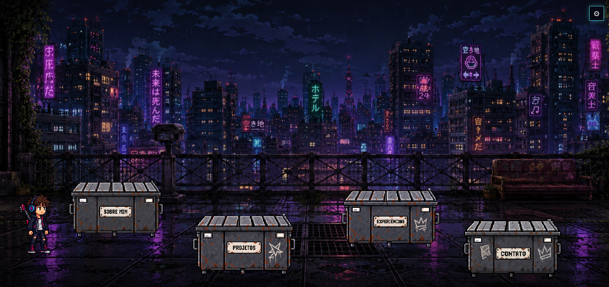
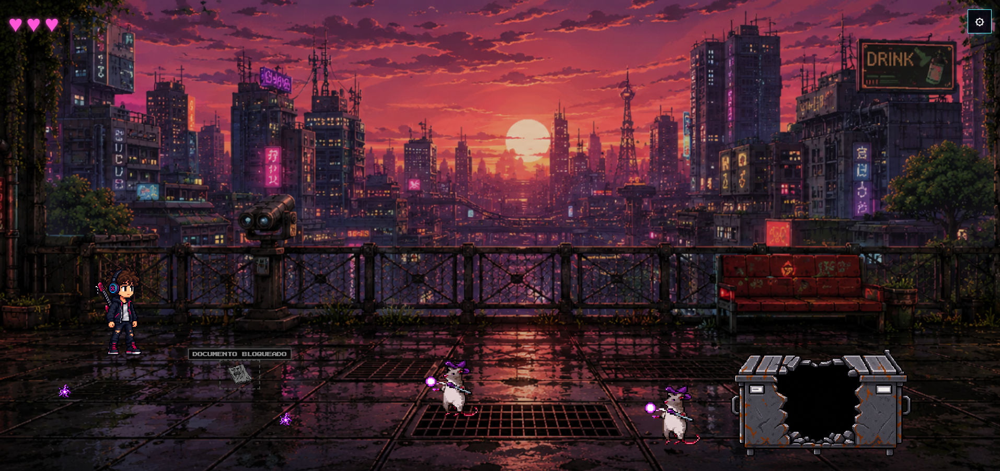
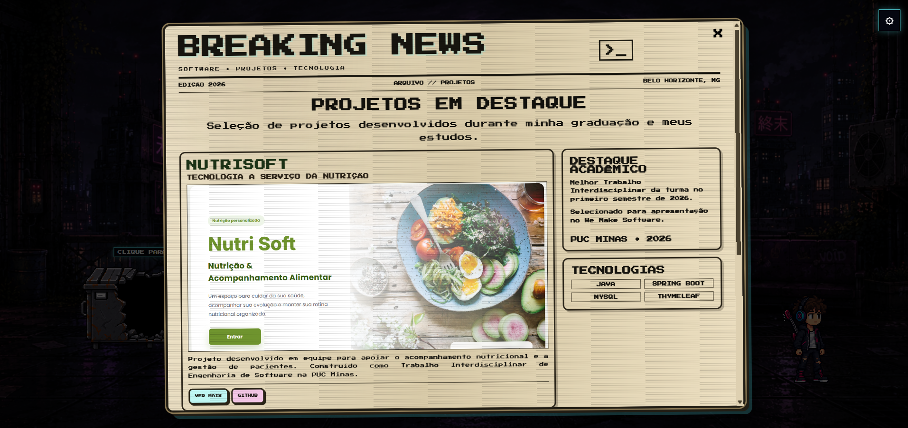

# Portfólio Interativo — Caio Santos Borges

Portfólio profissional desenvolvido como uma experiência interativa inspirada em jogos 2D.

O projeto apresenta informações sobre minha trajetória, experiências e projetos de forma gamificada, permitindo que o usuário explore diferentes cenários, interaja com elementos do ambiente e navegue pelas seções do portfólio.

O objetivo foi unir desenvolvimento web, criatividade e elementos de jogos para criar uma alternativa aos portfólios profissionais tradicionais.

---

## Acesse o projeto

🔗 **Site publicado:** [Acessar Portfólio](https://portifolio-ka6b.onrender.com)


---

## Wireframes

Antes do desenvolvimento da aplicação, foram criados wireframes para definir a estrutura das principais páginas, a disposição dos elementos e a organização da navegação do portfólio.

### Home


### Experiências


### Projetos


### Contato


---

## Projeto em execução

Abaixo estão algumas imagens da versão desenvolvida do portfólio, demonstrando a interface e a experiência de navegação.

### Tela inicial



### Experiência gamificada



### Página de projetos




---

## Funcionalidades

- Navegação inspirada em jogos 2D
- Movimentação do personagem pelo cenário
- Animações do personagem
- Diferentes cenários para cada seção
- Interação com elementos presentes no ambiente
- Página **Sobre Mim**
- Página de **Experiências**
- Página de **Projetos**
- Página de **Contato**
- Acesso aos repositórios dos projetos pelo GitHub
- Navegação entre as diferentes áreas do portfólio

---

## Tecnologias utilizadas

O projeto foi desenvolvido utilizando:

- **React** — construção da interface através de componentes
- **JavaScript** — lógica e interações da aplicação
- **HTML5** — estrutura das páginas
- **CSS3** — estilização, cenários e animações
- **Vite** — ambiente de desenvolvimento e build
- **Git** — controle de versão
- **GitHub** — hospedagem e gerenciamento do repositório

---

## Seções do portfólio

### Sobre Mim

Apresenta informações pessoais, interesses e um pouco da minha relação com tecnologia, criatividade, arte e música.

### Experiências

Apresenta minha experiência profissional e acadêmica, incluindo minha atuação como Monitor de Programação Modular na PUC Minas.

### Projetos

Reúne alguns dos principais projetos desenvolvidos durante minha formação e estudos, apresentando as tecnologias utilizadas, detalhes sobre cada projeto e links para seus respectivos repositórios.

### Contato

Disponibiliza formas de entrar em contato comigo e acessar meus perfis profissionais.

---

## Como utilizar

Ao acessar o portfólio, o usuário pode explorar os cenários e interagir com os elementos disponíveis no ambiente.

A navegação foi projetada para funcionar como uma pequena experiência de jogo, na qual o personagem pode se movimentar pelo cenário e acessar as diferentes áreas do portfólio.

Durante a exploração, elementos interativos permitem visualizar informações sobre minha trajetória, experiências e projetos.

---

## Como executar o projeto localmente

### Pré-requisitos

Antes de começar, é necessário ter instalado:

- [Node.js](https://nodejs.org/)
- [Git](https://git-scm.com/)

### 1. Clone o repositório

```bash
git clone https://github.com/cayo-puc/Portifolio.git
```

### 2. Entre na pasta do projeto

```bash
cd Portifolio
```

### 3. Instale as dependências

```bash
npm install
```

### 4. Execute o projeto

```bash
npm run dev
```

### 5. Acesse a aplicação

O Vite exibirá no terminal o endereço local da aplicação, normalmente:

```text
http://localhost:5173
```

Abra esse endereço no navegador.

---

## Build para produção

Para gerar a versão de produção:

```bash
npm run build
```

Os arquivos serão gerados na pasta:

```text
dist/
```

Para visualizar localmente a versão de produção:

```bash
npm run preview
```

---

## Estrutura geral

```text
PORTIFOLIO/
├── dist/
├── node_modules/
├── public/
│   ├── documents/
│   ├── images/
│   ├── favicon.svg
│   └── icons.svg
│
├── src/
│   ├── assets/
│   ├── components/
│   ├── pages/
│   ├── App.css
│   ├── App.jsx
│   ├── index.css
│   └── main.jsx
│
├── .gitignore
├── eslint.config.js
├── index.html
├── package-lock.json
├── package.json
├── README.md
└── vite.config.js
```

A aplicação utiliza componentes reutilizáveis para organizar elementos compartilhados entre os diferentes cenários e páginas do portfólio.

---

## Conceito do projeto

A proposta visual do portfólio foi inspirada em jogos 2D.

Em vez de apresentar apenas páginas tradicionais com textos e cards, o projeto utiliza um personagem controlável e diferentes cenários para representar as áreas do portfólio.

A ideia foi transformar a navegação em parte da experiência, combinando desenvolvimento web com elementos visuais e interativos de jogos.

---

## Contexto acadêmico

Projeto desenvolvido para a disciplina de **Projeto de Software**, do curso de **Engenharia de Software da PUC Minas**.

O trabalho propõe o desenvolvimento de um portfólio profissional individual contendo:

- Sobre Mim
- Experiências
- Projetos
- Contato

Além do desenvolvimento da aplicação, o projeto envolve ajustes de usabilidade, publicação da aplicação e documentação do processo de desenvolvimento.

---

## Autor

**Caio Santos Borges**

Engenharia de Software — PUC Minas

- GitHub: [@cayo-puc](https://github.com/cayo-puc)
- LinkedIn: [Caio Santos Borges](https://www.linkedin.com/in/caio-santos-borges-792591362/)
